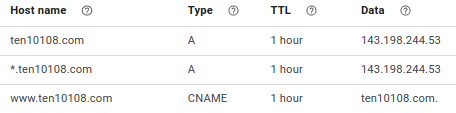

[home](../README.md)

## DNS Preparation

If you use [domains.google.com](https://domains.google.com), your DNS host entries should look something like this, 
replace ten10108.com with your domain name, and 143.198.244.53 with your IP address:

